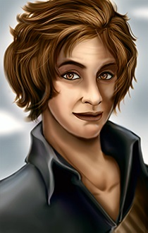

<html>

<b>Dace Linton</b>

<b>NPC mod for BG2EE and EET</b>

"I can see pretty easily what other people consider "good" an' "evil," and tell the difference, but I just don't understand why people get so concerned about doin' one or the other. Strikes me that the wisest thing to do is whatever the wisest thing is for whatever situation you're in, not whatever you've decided is some overarchin' truth. So I do "good" if I can profit and "evil" if I can profit and I won't get caught, and the hells can take the hinder most for all that I care which is which." 

Dace Linton is a Chaotic Neutral human female bounty hunter, about 33 years old. She will come over and speak to your PC if you leave or enter through the lower archway of Waukeen's Promenade, where you can find her standing on the steps. 

Dace is a slight, wiry woman with short brown hair and clothing of a decidedly nondescript colour and practical cut. She speaks in an unremarkable contralto voice, clipping some words strangely and finishing others with a slight lilt. She has a somewhat crooked grin, as though some emotion other than amusement always manages to twist her smile slightly at the last minute. Dace seems very fond of the notion of practicality but doesn't always practice what she preaches, and occasionally shows a streak of whimsicality that borders on ridiculousness. Ninety percent of the time she is operating on Full-Sarcastic, Half-Obnoxious mode, but she is also capable of brief moments of unique insight and kindness.

  
  

 
&nbsp;

&nbsp;

</body>

</html>

